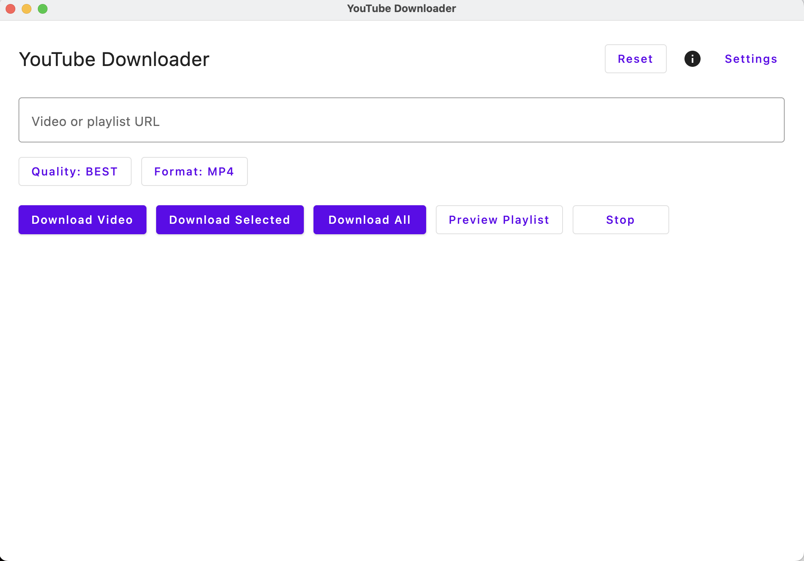

# YouTube Downloader

Small Kotlin Multiplatform tool (Compose Desktop + CLI) to download YouTube videos and playlists.


## Features
- Desktop app (Compose Desktop) and CLI
- Kotlin Multiplatform shared core (domain/data/engine/parser)
- Supports `ktor` native engine and `yt-dlp` engine
- MP3 extraction via `ffmpeg`


## Installation

Install the two common CLI tools used by the app: `yt-dlp` and `ffmpeg`. After installing, verify the binaries are available on your `PATH`.

### macOS (Homebrew recommended)

```bash
# Install via Homebrew
brew update
brew install yt-dlp ffmpeg

# Verify
which yt-dlp
which ffmpeg
yt-dlp --version
ffmpeg -version
```

**Note for macOS users:**
If you see a warning that the app "cannot be opened because Apple cannot check it for malicious software":

- Right‑click the app → Open → Open (bypasses the warning once), **or**
- Go to System Settings → Privacy & Security → "Open Anyway" (after attempting to open the app).


### macOS (pip fallback for `yt-dlp`)

```bash
python3 -m pip install -U yt-dlp
which yt-dlp
```


### Windows

Use one of the common package managers. Example (Scoop):

```powershell
# Scoop (user install)
scoop install yt-dlp
scoop install ffmpeg

# Verify
where.exe yt-dlp
where.exe ffmpeg
yt-dlp --version
ffmpeg -version
```

```powershell
# Chocolatey (admin)
choco install yt-dlp
choco install ffmpeg
# Verify
where.exe yt-dlp
where.exe ffmpeg
```


### Linux (Debian/Ubuntu) (NOT TESTED)

```bash
# Install ffmpeg from apt
sudo apt update
sudo apt install -y ffmpeg

# yt-dlp via pip (recommended) or your distro package
python3 -m pip install -U yt-dlp

# Verify
which yt-dlp
which ffmpeg
yt-dlp --version
ffmpeg -version
```


### Other Linux distributions

- Use the native package manager (dnf, pacman, zypper) to install `ffmpeg` if available.
- Install `yt-dlp` via `pip` or your distro's package if provided.


## Bundled binaries

You can use prebuilt `yt-dlp`/`ffmpeg` binaries. If you install manually, ensure the binary directory is on your `PATH` or paste the full path into the app Settings.





## Quickstart

### Desktop
1. Run the desktop app:

```bash
./gradlew :desktop-app:run
```
2. Accept the disclaimer, paste a video or playlist URL, choose quality/format, and download.

### CLI

```bash
./gradlew :cli:run --args="--url https://www.youtube.com/watch?v=... --format mp3"
```

Preview a playlist:

```bash
./gradlew :cli:run --args="--url https://www.youtube.com/playlist?list=... --playlist"
```


## Build

```bash
./gradlew clean build
```


## Packaging

Run the packaging tasks on the matching OS to generate native installers/binaries.


### macOS (DMG)

```bash
./gradlew :desktop-app:packageDmg
```


### Windows (Installer)

```bash
./gradlew :desktop-app:packageWindowsInstaller
```


### Linux (AppImage / package)

```bash
./gradlew :desktop-app:packageLinuxAppImage
# or packageLinuxDeb / packageLinuxTar depending on your nativeDistributions config
```


## Outputs and defaults
- Default download folder: `~/Downloads/YouTubeDownloader`

## Binaries and paths
- The app can use bundled `yt-dlp` and `ffmpeg` or fall back to system `PATH`.
- Configure paths in the Settings dialog in the desktop app or pass CLI flags `--yt-dlp-path` / `--ffmpeg-path`.


## Contributing
See `CONTRIBUTING.md` for development, testing, and PR guidance.


## Security
- Do not commit API keys or secrets. The project accepts an optional innertube API key via configuration; prefer environment variables or CI secrets.


## License
This project is licensed under the Apache License 2.0 — see `LICENSE`.

